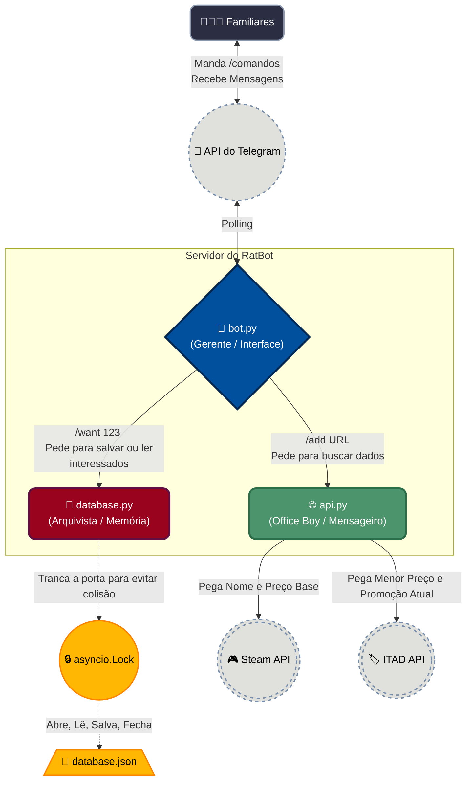

# RatFamilyBot 🐀

Um bot para o Telegram que substitui a planilha compartilhada para racharem jogos da Steam!

## Estrutura do Projeto
```
RatBot/
├── bot.py                 # Arquivo principal — conecta ao Telegram e recebe comandos
├── api.py                 # Comunicação externa (Steam API e ITAD API)
├── database.py            # Toda a lógica de leitura/escrita do banco de JSON
├── database.json          # Criado automaticamente na primeira execução
│
├── tests/                 # Testes unitários (pytest) — 55 testes
│   ├── conftest.py        # Fixtures reutilizáveis (mock_update, mock_context)
│   ├── test_api.py        # 18 testes — URLs, Steam API, ITAD, erros
│   ├── test_bot.py        # 20 testes — todos os comandos + helpers
│   ├── test_database.py   # 17 testes — CRUD, edge cases, resiliência
│   └── benchmarks/        # Scripts de performance
│       ├── bench_database.py  # I/O, lookup, scan benchmarks
│       └── bench_api.py       # Overhead de processamento de API
│
├── docs/                  # Documentação técnica
│   └── performance_analysis.md  # Análise Big-O e resultados de benchmark
├── notebooks/             # Notebooks de experimentação
│   └── teste.ipynb
│
├── CHANGELOG.md           # Histórico de versões e roadmap do projeto
├── README.md              # Este arquivo
├── requirements.txt       # Dependências do projeto
├── .env                   # Seu Token do Telegram e Chave do ITAD (NUNCA compartilhe!)
└── .gitignore             # Arquivos ignorados pelo Git
```

### Arquitetura do Sistema



## Configuração Inicial

1. **Instale as dependências** (só precisa fazer isso UMA VEZ):
   Abra o terminal na pasta do projeto e rode:
   ```bash
   pip install -r requirements.txt
   ```

2. **Configure suas chaves no `.env`**:
   Crie um arquivo `.env` na raiz do projeto com o seguinte conteúdo:
   ```env
   BOT_TOKEN=seu_token_do_telegram_aqui
   ITAD_API_KEY=sua_chave_do_isthereanydeal_aqui
   ```

## Executando o Projeto

### 1. Iniciar o bot
```bash
python bot.py
```
Você verá a mensagem `✅ Bot is running!`. Para parar, pressione **Ctrl+C**.

### 2. Rodar os testes
Garantimos a qualidade do código com 55 testes unitários. Para rodá-los:
```bash
# Rodar todos os testes
python -m pytest tests/ -v

# Rodar com relatório de cobertura
python -m pytest tests/ -v --cov=. --cov-report=term-missing
```

### 3. Benchmarks de performance
```bash
# Benchmark do database (I/O, lookup, scan)
python tests/benchmarks/bench_database.py

# Benchmark da API (overhead de processamento)
python tests/benchmarks/bench_api.py
```

Consulte `docs/performance_analysis.md` para análise detalhada de Big-O, resultados e recomendações.

## Comandos do Bot

| Comando | Status | Descrição |
|---------|--------|-----------|
| `/start` | ✅ Pronto | Mensagem de boas-vindas |
| `/help` | ✅ Pronto | Lista de comandos detalhada |
| `/add [URL]` | ✅ Pronto | Adiciona jogo recebendo dados da Steam e ITAD |
| `/want [ID\|URL]` | ✅ Pronto | Registra interesse e calcula divisão do custo |
| `/list` | ✅ Pronto | Lista formatada de todos os jogos com preços e loja do melhor deal |
| `/game [ID]` | ✅ Pronto | Detalhes completos de um jogo: preços, status, interessados e racha |
| `/delete [ID]` | 🚧 Em breve | Remove um jogo específico da lista |
| `/unwant [ID]` | 🚧 Em breve | Sai do racha de um jogo específico informando apenas o AppID |
| `/update [ID]` | 🚧 Em breve | Atualiza os preços atuais de um jogo específico |
| `/all2date` | 🚧 Em breve | Atualiza os preços de todos os jogos na base de dados iterativamente |

